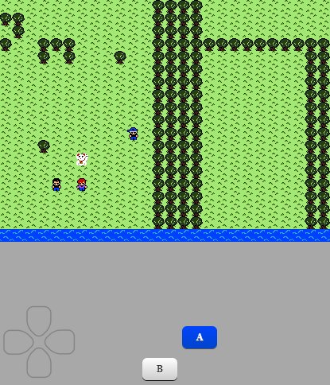

# RPG in JavaScript -> Enchant.js:
   

## Demo online:
https://gabrieldarezzo.github.io/rpg/

## Objetivo:
Usar o `Enchant.js` e apartir das sprites:
   
   
Criar uma especie de RPG.

### YouTube:
https://www.youtube.com/watch?v=x2EbfsQbsLI&list=PLsrZV8shpwjMxD9LZ6qsKrtWR7xQEv192

Provavelmente o `Enchant.js` como  ferramenta hoje já está obsoleta.
Mas as ideias de de gameLoop, Sprites, collision são muito bem exemplificadas no decorrer do curso.
 
Recomendo dar uma olhada nessas libs:
 * https://phaser.io/  
 * http://www.melonjs.org/  

